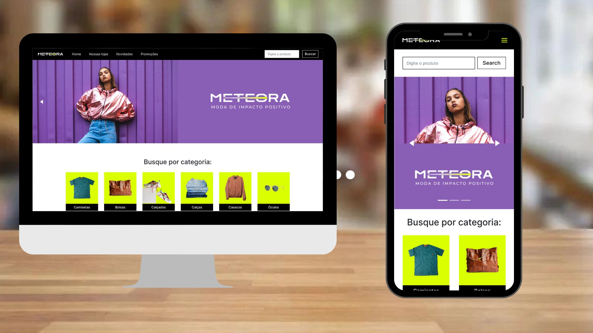

<div align="center">
  
  
  
</div>
<div align="center">


 <a href="#-sobre-o-projeto">Sobre</a> •
  <a href="#-funcionalidades">Funcionalidades</a> •
 <a href="#-layout">Layout</a> • 
 <a href="#-como-executar-o-projeto">Como executar</a> • 
 <a href="#-tecnologias">Tecnologias</a> • 
 <a href="#-como-contribuir-para-o-projeto">Como contribuir</a> • 
 <a href="#-licença">Licença</a>
  
</div>

## 💻 Sobre o projeto
A Meteora Modas é uma empresa fictícia do ramo do comércio eletrônico de roupas atemporais, casuais e sem gênero. O projeto consiste em uma página de e-commerce desenvolvida com o intuito de estudo do React.Js.

Projeto desenvolvido durante a Challenge Front-end oferecida pela [Alura](https://alura.com.br). A Challenge Front-end é um evento que coloca seus participantes no papel de um Dev durante três semanas, recebendo as tasks semanalmente por meio de um board no [Trello](https://trello.com), onde o participante tem autonomia e flexibilidade para criar utilizando suas ferramentas e tecnologias preferidas.

## 🧰 Funcionalidades
- [x] Possuir um cabeçalho com uma barra de navegação para demais páginas do site;
- [x] Permitir a busca de produtos que contenham o texto no titulo ou na descrição;
- [x] Permitir a exibição de um carrosel com banners promocionais;
- [x] Permitir a listagem dos produtos da loja;
- [x] Permitir filtrar os produtos por categoria;
- [x] Ao selecionar o produto, exibir detalhes e opções do mesmo em um modal;
- [x] O projeto deve ser responsivo para ser exibido em desktop, tablet e mobile.

## 🎨 Layout
O layout da aplicação está disponível no figma:<br />




## 🚀 Como executar o projeto
### Pré-requisitos
Para executar o projeto, você vai precisar ter instalado em sua máquina as seguintes ferramentas: [Git](https://git-scm.com), [Node.js](https://nodejs.org/en/). Além disto é bom ter um editor para trabalhar com o código como [VSCode](https://code.visualstudio.com/).

### Clonando o repositório
```bash
# Clone o repositório
$ git clone git@github.com:eduhaag/meteora-modas.git

# Acesse a página do projeto
$ cd meteora-modas

# Instale as dependências
$ npm install

# Rode o backend
$ npx json-server db.json

# Rode o projeto
$ npm run dev

# O servidor front-end será inicializado na porta padrão 5173). Acesso http://localhost:5173. 
# Caso a porta já esteja sendo usada, será informado a porta utilizada na saida do terminal.
```

## 🛠️ Tecnologias
- **[React](https://react.dev/)**;
- **[Typescript](https://www.typescriptlang.org/)**;
- **[Vite](https://vitejs.dev/)** - Para agilizar o processo de criação e configuração do projeto;
- **[Axios](https://axios-http.com/)** - Realiza a comunicação com o backend por meio de requisições HTTP;
- **[react-router-dom](https://reactrouter.com/)** - Conduz o roteamento das páginas dentro da SPA;
- **[react-modal](https://github.com/reactjs/react-modal)** - Traz uma forma fácil de trabalhar e personalizar modais;
- **[react-responsive-carousel](https://github.com/leandrowd/react-responsive-carousel)** - Componente de carrossel poderoso, leve e totalmente personalizável para aplicativos React;
- **[Stylef Components](https://styled-components.com/)** - Possibilita escrever códigos CSS dentro do JavaScript;
- **[Json-server](https://github.com/typicode/json-server)** - Cria um servidor back-end a partir de um arquivo JSON.
> Veja o arquivo [package.json](https://github.com/eduhaag/Memoteca/package.json)


**Utilitários**
- Protótipo: **[Figma](https://www.figma.com/file/TIOVepSv2kcG8WkogxENpo/Challenge-Front-end-%7C-Loja-Meteora?type=design&node-id=2386%3A2430&mode=design&t=o7fn4NhVVRcqQ3Xp-1)**;
- Editor:  **[Visual Studio Code](https://code.visualstudio.com/)**;
- Fontes: **[Inter](https://fonts.google.com/specimen/Inter)**.

## 💪 Como contribuir para o projeto
1. Faça um **fork** do projeto.
2. Crie uma nova branch com as suas alterações: `git checkout -b my-feature`
3. Salve as alterações e crie uma mensagem de commit contando o que você fez: `git commit -m "feature: My new feature"`
4. Envie as suas alterações: `git push origin my-feature`

## 📝 Licença
Este projeto está sobe a licença MIT.
